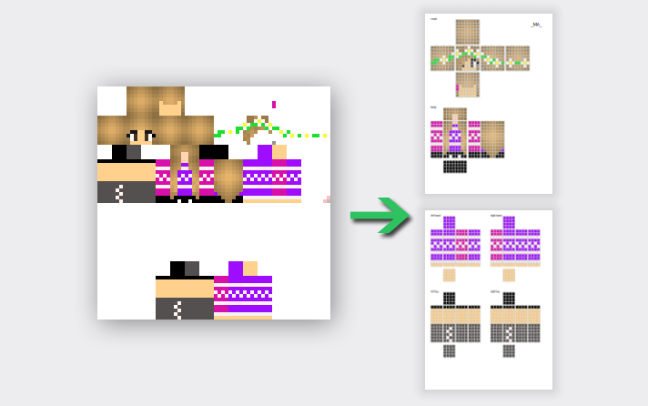
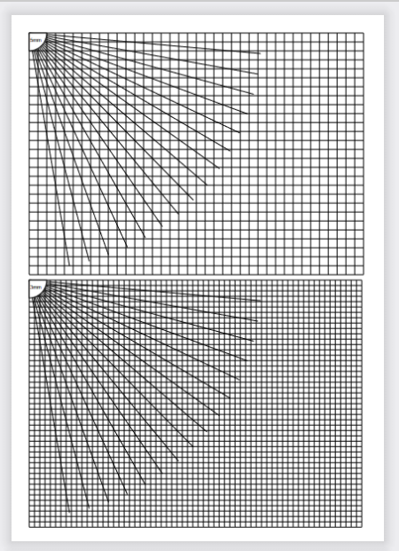

# Maincraft skin to PDF converter
Конвертирует PNG картинки со скином Maincraft (только мобы) в PDF для разрисовки 3D ручкой \

Есть возможность рисовать сетки. \

После распечатки страницы можно заламинировать. И будет отличный шаблон для 3D ручки. 

Релиз можно скачать здесь в папках релизов.
Пока есть сборка под [Windows x64](/vhangout/mainskin/releases/download/latest/mcs2pdf.zip) 